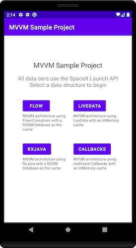
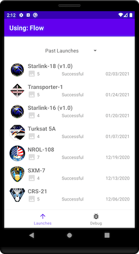
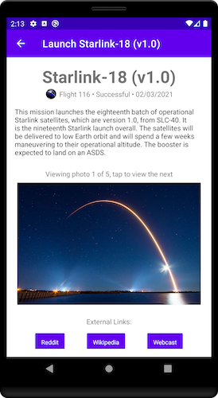
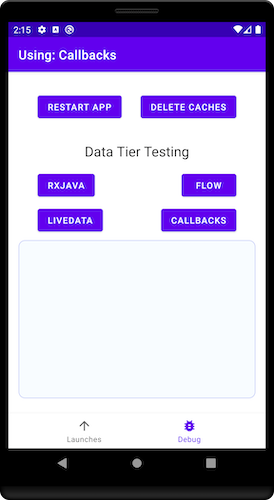

Android SpaceX MVVM Architecture Project
========================================

This Android project is using a MVVM (Model-View-ViewModel)
architecture, implemented with several different example observer patterns and data storage strategies.

This project is still under development, see the TODO

Introduction
------------

My name is Matthew Rohr, an Android Developer. I recently finished a two
year contract working as an Android Developer/Consultant on the Hulu
Android mobile app. I have been developing Android projects since 2012.
* [LinkedIn Profile](https://www.linkedin.com/in/matthew-r-rohr/)
* [Past Projects](https://www.firstcenturythinking.com/projects/mobile-app-projects)
(both personal and contracted)

This GitHub project was created and made public for a couple reasons:
* `Show & Tell` for tech/contracting interviews
* **Quick Reference Guide** - As a contractor, moving between client Android tech stacks can be dizzying. In my experience, most
  clients are moving toward MVVM but still differ on how it is implemented.  Having a quick reference for interview prep and development is helpful.
* **FLOW/Coroutine Implementation** - Been eager to play with this, to get an idea how it compares to RxJava.  Loving it so far.

#### Why Multiple Patterns??
The data layer (observer choices and cache management) is the most complex part of the app. I
have worked on numerous Android projects that moved toward MVVM but
implemented the actual observer pattern and data storage strategy several different ways.  This
in part is why I included these as example implementations:
* Flow using Coroutines with Room DB
* RxJava with Room DB
* LiveData with an InMemCache
* Traditional Callbacks with an InMemCache - *transitions into `LiveData` within the `ViewModel` to help facilitate the MVVM architecture*

App Screenshots
---------------
Simple four screen app using the SpaceX Launches api:

Pattern Implementations - Quick Links
-------------------------------------

**Flow**  
[LaunchFlowFragment](app/src/main/java/com/fct/mvvm/views/LaunchFlowFragment.kt) <->
[FlowViewModel](app/src/main/java/com/fct/mvvm/viewmodels/FlowViewModel.kt) <->
[FlowRepository](app/src/main/java/com/fct/mvvm/data/repository/FlowRepository.kt) <-
([SpaceXDatabase](app/src/main/java/com/fct/mvvm/data/database/SpaceXDatabase.kt) ||
[SpaceXApi](app/src/main/java/com/fct/mvvm/api/SpaceXApi.kt))

**RxJava**  
[LaunchRxJavaFragment](app/src/main/java/com/fct/mvvm/views/LaunchRxJavaFragment.kt) <->
[RxJavaViewModel](app/src/main/java/com/fct/mvvm/viewmodels/RxJavaViewModel.kt) <->
[RxJavaRepository](app/src/main/java/com/fct/mvvm/data/repository/RxJavaRepository.kt) <-
([SpaceXDatabase](app/src/main/java/com/fct/mvvm/data/database/SpaceXDatabase.kt) ||
[SpaceXApi](app/src/main/java/com/fct/mvvm/api/SpaceXApi.kt))

**LiveData**  
[LaunchLiveDataFragment](app/src/main/java/com/fct/mvvm/views/LaunchLiveDataFragment.kt) <->
[LiveDataViewModel](app/src/main/java/com/fct/mvvm/viewmodels/LiveDataViewModel.kt) <->
[LiveDataRepository](app/src/main/java/com/fct/mvvm/data/repository/LiveDataRepository.kt) <-
([AgedMemoryCache](app/src/main/java/com/fct/mvvm/data/repository/AgedMemoryCache.kt) ||
[SpaceXApi](app/src/main/java/com/fct/mvvm/api/SpaceXApi.kt))

**Callbacks**  
[LaunchCallbackFragment](app/src/main/java/com/fct/mvvm/views/LaunchCallbackFragment.kt) <->
[CallBackViewModel](app/src/main/java/com/fct/mvvm/viewmodels/CallBackViewModel.kt) <->
[CallbackRepository](app/src/main/java/com/fct/mvvm/data/repository/CallbackRepository.kt) <-
([AgedMemoryCache](app/src/main/java/com/fct/mvvm/data/repository/AgedMemoryCache.kt) ||
[SpaceXApi](app/src/main/java/com/fct/mvvm/api/SpaceXApi.kt))  

Technology Stack
----------------
1. [MVVM Architecture](https://developer.android.com/jetpack/guide)
2. [Android Jetpack Components](https://developer.android.com/jetpack)
3. [Kotlin & Extensions](https://developer.android.com/kotlin)
4. [ViewModel](https://developer.android.com/topic/libraries/architecture/viewmodel)
5. [RxJava](https://github.com/ReactiveX/RxJava) (observer/data pattern example)
6. [LiveData](https://developer.android.com/topic/libraries/architecture/livedata) (observer/data pattern example)
7. [Flow](https://developer.android.com/reference/java/util/concurrent/Flow?hl=en) (observer/data pattern example)
8. Traditional Callbacks (pattern example)
9. [Coroutines](https://kotlinlang.org/docs/reference/coroutines-overview.html)
10. [ConstraintLayout](https://developer.android.com/training/constraint-layout)
11. InMemory Cache
12. [ROOM Database](https://developer.android.com/topic/libraries/architecture/room) (disk cache)
13. [Retrofit](https://square.github.io/retrofit/) (for api communications)
14. [Picasso](https://square.github.io/picasso/) (for images)
15. [SpaceX API](https://docs.spacexdata.com/) (free and easy to use)
16. [MocKK](https://mockk.io/) (testing library which is more friendly with Kotlin than Mockito)

//TODO - all the things
-----------------------

Still lots todo on this project

##### Dependency Injection
Several files in this project are screaming to be `Singletons`, which I plan to implement with DI.

Last project I worked on used
[Toothpick](https://github.com/stephanenicolas/toothpick/) for DI, but I
personally would like to try
[Dagger](https://developer.android.com/training/dependency-injection/dagger-android),
which appears to be a bit more main stream.

##### Additional Test Coverage
You can never have enough test coverage:
* Fragment Scenario Tests
* Additional Unit Tests
* Android Instrumentation Tests

##### Single Activity Architecture
This is fascinating and seems to work well with Androids new [Navigation](https://developer.android.com/guide/navigation) component
